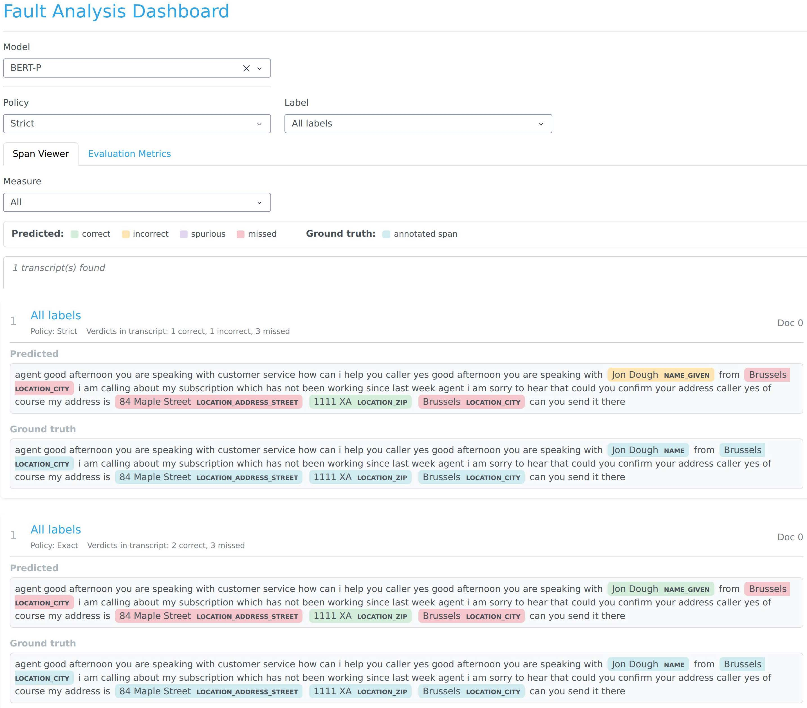

# NERvis — Fault Analysis Tool and Evaluation Framework

This repository contains the software artifact that accompanies the paper *When "John Doe" Becomes "Jon Dough": An Industrial Study on Automated Natural Language Anonymization*. It provides two components:

- `nervis.py` — the interactive fault analysis dashboard introduced in the paper.
- `evaluation_framework.ipynb` — the evaluation pipeline used to compute span-level performance metrics and per-entity indices.

## Repository layout

```
.
├── nervis.py
├── evaluation_framework.ipynb
├── nervis.jpg
├── data/
│   └── mock_transcript.txt
└── README.md
```

## Requirements

The scripts were developed and tested with Python 3.11. Install the dependencies with:

```bash
pip install dash dash-bootstrap-components pandas plotly nervaluate jupyter
```

## Running the fault analysis tool

From the repository root, run:

```bash
python nervis.py
```

The Dash application starts on `http://127.0.0.1:8050`. Open this address in a browser to interact with the tool.

## Running the evaluation notebook

Launch Jupyter and open the notebook:

```bash
jupyter notebook evaluation_framework.ipynb
```

Execute the cells in order. The notebook constructs the mock dataset, runs the `nervaluate` evaluator across the Exact and Strict evaluation policies, and produces two dataframes: `evaluation_metrics_df` (overall and per-entity metrics) and `indices_df` (per-entity index buckets for correct, incorrect, missed and spurious outcomes).

## Mock example

The original data ingestion has been removed because the underlying customer service transcripts are proprietary and cannot be released. The scripts ship with a small mock dataset so they can be executed standalone for demonstration and reproducibility. The transcript text is loaded from `data/mock_transcript.txt`. All identifiers in the mock data (names, streets, postal codes) are randomly chosen and do not correspond to real individuals or addresses.

## Dashboard at a glance



The dashboard provides controls for selecting the model, policy, label scope and measure. Each card displays a transcript with the predicted spans above the manually annotated ground-truth spans. Predicted spans are colored by per-span verdict under the active policy: correct in green, incorrect in orange, spurious in purple, missed in red. Ground-truth spans use a single color regardless of verdict.

The screenshot shows the same transcript under the two evaluation policies of the study. Under Strict (top), the prediction on *Jon Dough* is incorrect because the predicted label `NAME_GIVEN` does not match the ground-truth label `NAME`. Under Exact (bottom), the same prediction is correct because the entity label is not considered.

## Applying the tool to a different corpus

Replace `data/mock_transcript.txt` with the target transcripts and update the predicted and ground-truth span lists in `nervis.py` and `evaluation_framework.ipynb` so that they follow the same schema (`text`, `label`, `start`, `end`).